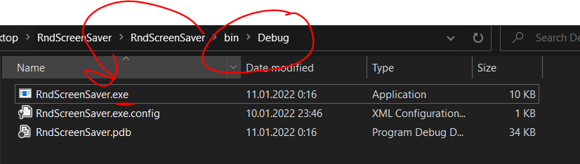

# Forms-ScreenSaver-RndNumbers
This app is about Windows screen saver that show up pseudorandom numbers. (school homework)

Source for this app: https://sites.harding.edu/fmccown/screensaver/screensaver.html

## How to install screen saver?

1. Find the .exe file
2. Change .exe to .scr
3. Right click on .scr file and click install.
4. Enjoy

